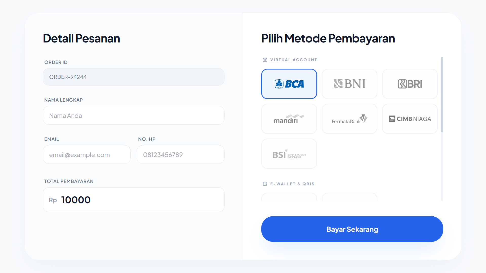

# Midtrans Payment Simulator



A simple web-based simulator for Midtrans Core API payments. This application allows you to simulate various payment methods in the Midtrans Sandbox environment including Bank Transfers, QRIS, GoPay, and Convenience Store payments.

## Prerequisites

- [Node.js](https://nodejs.org/) (v20 or higher)
- Midtrans Sandbox Account
- Midtrans Server Key from [Dashboard](https://dashboard.sandbox.midtrans.com/settings//access-keys)

## Setup Instructions

1. **Clone the repository** (or download the source code).
2. **Install dependencies**:
   ```bash
   npm install
   ```
3. **Configure Environment Variables**:
   Create a `.env` file in the root directory and add your Server Key:
   ```env
   MIDTRANS_SERVER_KEY=your_server_key_here
   PORT=3000
   ```
   *Note: Use the `.env.example` as a template.*

## Running the Application

1. **Start the server**:
   ```bash
   node server.js
   ```
   or using npm scripts:
   ```bash
   npm start
   ```
2. **Access the application**:
   Open your browser and go to `http://localhost:3000`.

## Features

- **Multi-Method Support**: Supports BCA, BNI, BRI, Mandiri, Permata, CIMB, BSI, QRIS, GoPay, Alfamart, Indomaret, and Akulaku.
- **Auto-Polling**: The application automatically polls for transaction status and displays a success modal upon completion.
- **Integrated Simulator**: Includes direct links to the Midtrans Sandbox Simulator for each payment method.
- **DeepLink Integration**: GoPay simulator is pre-filled with the transaction deeplink for a seamless testing experience.

## Project Structure

- `index.html`: The main entry point for the application.
- `server.js`: Express server that acts as a proxy to Midtrans API to avoid CORS issues and handle server-side logic.
- `assets/css/`: Contains the application's stylesheets.
- `assets/js/`: Contains the configuration (`config.js`) and main application logic (`script.js`).
- `assets/images/`: Contains logo SVGs for payment methods.
